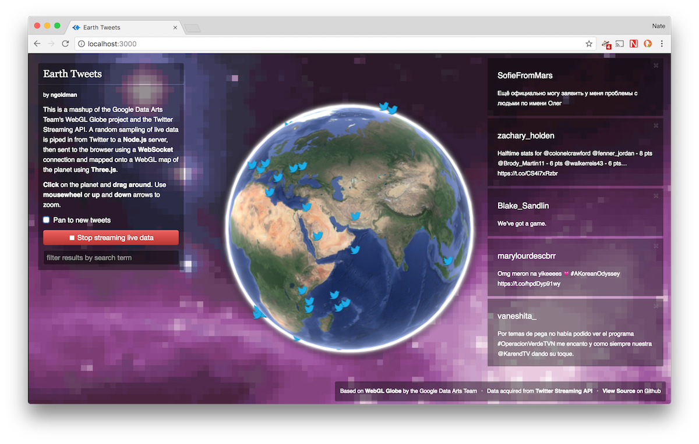

# Earth Tweets

A mashup of Google's WebGL Globe and Twitter's Streaming API.

Created December 2012.

## Setup

This tech demo requires a working copy of Node.js, a browser, and an internet connection.

To get this working locally, you'll need to set 4 environment variables from Twitter's [application management portal](https://apps.twitter.com):

- `EARTH_TWEETS_CONSUMER_KEY`: a consumer key
- `EARTH_TWEETS_CONSUMER_SECRET`: a consumer secret
- `EARTH_TWEETS_ACCESS_TOKEN`: an access token
- `EARTH_TWEETS_ACCESS_TOKEN_SECRET`: an access token secret

These can all be acquired by registering a new application.

Once that's done, all you need to do is run `npm install` and `npm start`. If everything went well, you should have a server running at http://localhost:3000.

## Credit/Inspiration

* Google's [WebGL Globe](http://www.chromeexperiments.com/globe)
* Jaume Sánchez's [World Weather](http://www.clicktorelease.com/code/weather)

## License

MIT
